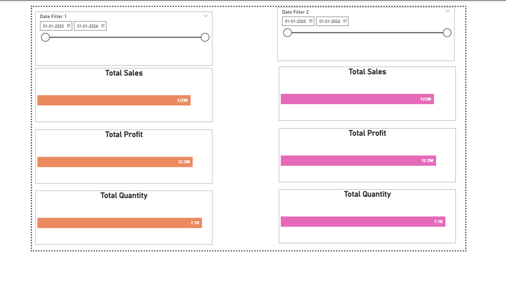
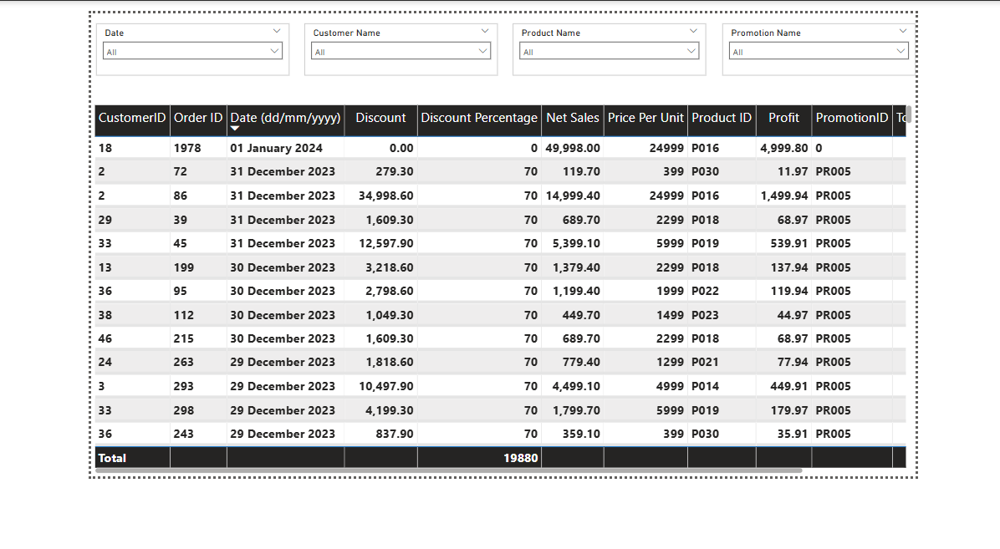

# 📊 Sales Analysis Dashboard

This Power BI project is focused on a detailed **Sales Analysis Dashboard** built using Excel data. It aims to uncover meaningful insights into product performance, sales trends, profit behavior, discount effectiveness, and customer purchasing patterns.

---

## 📌 Project Objectives

The dashboard answers the following key business questions:

1. Top/Bottom 5 products by **Sales**, **Profit**, and **Quantity Sold**.
2. How do sales trends vary over **daily, monthly, quarterly, and annual** timeframes?
3. What is the relationship between **Sales** and **Profit**?
4. Comparison of **Sales**, **Profit**, and **Quantity Sold** between **any two user-selected periods**.
5. Average discount offered in each **discount category**.
6. Total **number of orders** placed.
7. Dynamic filtering of **Sales**, **Profit**, **Discount**, **Net Sales**, and other fields using visual slicers (e.g., **Product**, **Date**, **Customer ID**, **Promotion Categories**).
8. Breakdown of **Sales by different cities**.

---

## 📂 Data Source

- The project uses an **Excel dataset** containing sales transaction-level data, including metrics like product name, order quantity, unit price, discount, city, and customer details.

---

## 📈 Key Visualizations

The Power BI report utilizes:

- 📊 **Stacked Bar Charts**
- 📉 **Scatter Plots**
- 📋 **Table Visuals**
- 🔘 **Slicers and Filters** for interactivity
- 📌 Dynamic comparisons using **Date Range Filters**

---

### 🖼️ Dashboard Previews

#### 🔹 5 Top/Bottom Sales Analysis  

#### 🔹 Overview 

#### 🔹 Comparison Sales/Quantity/Profit

#### 🔹 Table Visual

---

## 💡 Insights & Benefits

- Easily identify top- and bottom-performing products
- Understand how discounts influence sales
- Explore city-wise performance and customer segmentation
- Enable business stakeholders to make data-driven decisions with an interactive interface

---

## 🚀 How to Use

1. Clone/download this repository.
2. Open the `.pbix` file using **Power BI Desktop**.
3. Interact with the slicers to explore different insights.
4. Use time filters to compare performance across periods.

---

## 📃 License

This project is licensed under the [MIT License](LICENSE).

---

## 🙌 Acknowledgements

Special thanks to the dataset providers and the Power BI community for tutorials and visualization inspiration.
